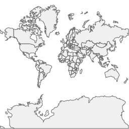

# Map Router for Koa
This is a Koa map router built by Ginkgoch. It includes predefined mapping RESTful APIs of maps you created.

## Install
```
yarn add ginkgoch-koa-map-router
```

## Usage
```javascript
import path from 'path';
import Koa from "koa";
import { MapRouter } from 'ginkgoch-koa-map-router';
import { MapEngine, Srs, ShapefileFeatureSource, Projection, FeatureLayer, FillStyle } from "ginkgoch-map";

function getInitMap(name) {
    const CRS_GOOGLE = 'EPSG:900913';
    let mapEngine = new MapEngine(256, 256);
    mapEngine.name = name;
    mapEngine.srs = new Srs(CRS_GOOGLE);

    let sourcePath = path.resolve(__dirname, '../data/cntry02.shp');
    let source = new ShapefileFeatureSource(sourcePath);
    source.projection = new Projection(CRS_GOOGLE, CRS_GOOGLE);
    
    let layer = new FeatureLayer(source);
    layer.styles.push(new FillStyle('#f0f0f0', '#636363', 1));
    mapEngine.pushLayer(layer);

    return mapEngine;
}

function serve() {
    const port = 3000;
    const app = new Koa();
    const mapRouter = new MapRouter({ initMap: getInitMap }).getRouter();
    app.use(mapRouter.routes()).use(mapRouter.allowedMethods());
    app.listen(port, () => console.log(`Server listening on http://localhost:${port}`));
}

serve();
```

## Predefined APIs
This is the map router for KOA and Ginkgoch Map Library.

* [Get current map state](#get-current-map-state)
* [Get map xyz tile image](#get-map-xyz-tile-image)
* [Get groups state](#get-groups-state)
* [Get a group by name](#get-a-group-by-name)
* [Get all layers in a specified group](#get-all-layers-in-a-specified-group)
* [Get a layer in a specified group](#get-a-layer-in-a-specified-group)
* [Get all fields info in a specified layer](#get-all-fields-info-in-a-specified-layer)
* [Get features from a specific layer](#get-features-from-a-specific-layer)
* [Query features from a specific layer](#query-features-from-a-specific-layer)
* [Get all properties from a specific layer](#get-all-properties-from-a-specific-layer)
* [Get a property values from a specific layer](#get-a-property-values-from-a-specific-layer)


### Get current map state
GET: `/maps/{{map}}`

#### Example 1: Get current map state
* GET: `http://localhost:3000/maps/Default`

* Response:
```json
{
    "name": "Map",
    "srs": {
        "projection": "EPSG:900913",
        "unit": "m"
    },
    "width": 256,
    "height": 256,
    "origin": "upperLeft",
    "maximumScale": 10000000000,
    "minimumScale": 0,
    "scales": [
        591659030.6768064,
        ...
    ],
    "groups": [
        {
            "type": "layer-group",
            "name": "Default",
            "visible": true,
            "layers": [
                {
                    "type": "feature-layer",
                    "id": "layer-j64mybw4",
                    "name": "cntry02",
                    "source": {
                        "type": "shapefile-feature-source",
                        "name": "cntry02",
                        "projection": {
                            "from": {
                                "unit": "unknown"
                            },
                            "to": {
                                "unit": "unknown"
                            }
                        },
                        "flag": "rs",
                        "filePath": "./data/cntry02.shp"
                    },
                    "styles": [
                        {
                            "visible": true,
                            "id": "style-dmgb3m8w",
                            "type": "fill-style",
                            "name": "Fill Style",
                            "maximumScale": 10000000000,
                            "minimumScale": 0,
                            "lineWidth": 1,
                            "fillStyle": "#f0f0f0",
                            "strokeStyle": "#636363"
                        }
                    ],
                    "minimumScale": 0,
                    "maximumScale": 10000000000,
                    "visible": true
                }
            ]
        }
    ]
}
```

### Get map xyz tile image
GET: `/maps/{{map}}/tiles/xyz/{{z}}/{{x}}/{{y}}`

#### Example 1: Get map xyz tile image
* GET: `http://localhost:3000/maps/Default/tiles/xyz/0/0/0`

* Response:



### Get groups state
GET: `/maps/{{map}}/groups`

#### Example 1: Get groups state
* GET: `http://localhost:3000/maps/Default/groups`

* Response:
```json
[
    {
        "type": "layer-group",
        "name": "Default",
        "visible": true,
        "layers": [
            {
                "type": "feature-layer",
                "id": "layer-j64mybw4",
                "name": "cntry02",
                "source": {
                    "type": "shapefile-feature-source",
                    "name": "cntry02",
                    "projection": {
                        "from": {
                            "unit": "unknown"
                        },
                        "to": {
                            "unit": "unknown"
                        }
                    },
                    "flag": "rs",
                    "filePath": "./data/cntry02.shp"
                },
                "styles": [
                    {
                        "visible": true,
                        "id": "style-dmgb3m8w",
                        "type": "fill-style",
                        "name": "Fill Style",
                        "maximumScale": 10000000000,
                        "minimumScale": 0,
                        "lineWidth": 1,
                        "fillStyle": "#f0f0f0",
                        "strokeStyle": "#636363"
                    }
                ],
                "minimumScale": 0,
                "maximumScale": 10000000000,
                "visible": true
            }
        ]
    }
]
```

### Get a group by name
GET: `/maps/{{map}}/groups/{{group}}`

#### Example 1: Get a group by name
* GET: `http://localhost:3000/maps/Default/groups/Default`

* Response:
```json
{
    "type": "layer-group",
    "name": "Default",
    "visible": true,
    "layers": [
        {
            "type": "feature-layer",
            "id": "layer-j64mybw4",
            "name": "cntry02",
            "source": {
                "type": "shapefile-feature-source",
                "name": "cntry02",
                "projection": {
                    "from": {
                        "unit": "unknown"
                    },
                    "to": {
                        "unit": "unknown"
                    }
                },
                "flag": "rs",
                "filePath": "./data/cntry02.shp"
            },
            "styles": [
                {
                    "visible": true,
                    "id": "style-dmgb3m8w",
                    "type": "fill-style",
                    "name": "Fill Style",
                    "maximumScale": 10000000000,
                    "minimumScale": 0,
                    "lineWidth": 1,
                    "fillStyle": "#f0f0f0",
                    "strokeStyle": "#636363"
                }
            ],
            "minimumScale": 0,
            "maximumScale": 10000000000,
            "visible": true
        }
    ]
}
```

### Get all layers in a specified group
GET: `/maps/{{map}}/groups/{{group}}/layers`

#### Example 1: Get all layers in a specified group
* GET: `http://localhost:3000/maps/Default/groups/Default/layers`

* Response:
```json
[
    {
        "type": "feature-layer",
        "id": "layer-j64mybw4",
        "name": "cntry02",
        "source": {
            "type": "shapefile-feature-source",
            "name": "cntry02",
            "projection": {
                "from": {
                    "unit": "unknown"
                },
                "to": {
                    "unit": "unknown"
                }
            },
            "flag": "rs",
            "filePath": "./data/cntry02.shp"
        },
        "styles": [
            {
                "visible": true,
                "id": "style-dmgb3m8w",
                "type": "fill-style",
                "name": "Fill Style",
                "maximumScale": 10000000000,
                "minimumScale": 0,
                "lineWidth": 1,
                "fillStyle": "#f0f0f0",
                "strokeStyle": "#636363"
            }
        ],
        "minimumScale": 0,
        "maximumScale": 10000000000,
        "visible": true
    }
]
```

### Get a layer in a specified group
GET: `/maps/{{map}}/groups/{{group}}/layers/{{layer}}`

#### Example 1: Get a layer named "cntry02" in a specified group named "Default"
* GET: `http://localhost:3000/maps/Default/groups/Default/layers/cntry02`

* Response:
```json
{
    "type": "feature-layer",
    "id": "layer-j64mybw4",
    "name": "cntry02",
    "source": {
        "type": "shapefile-feature-source",
        "name": "cntry02",
        "projection": {
            "from": {
                "unit": "unknown"
            },
            "to": {
                "unit": "unknown"
            }
        },
        "flag": "rs",
        "filePath": "./data/cntry02.shp"
    },
    "styles": [
        {
            "visible": true,
            "id": "style-dmgb3m8w",
            "type": "fill-style",
            "name": "Fill Style",
            "maximumScale": 10000000000,
            "minimumScale": 0,
            "lineWidth": 1,
            "fillStyle": "#f0f0f0",
            "strokeStyle": "#636363"
        }
    ],
    "minimumScale": 0,
    "maximumScale": 10000000000,
    "visible": true,
    "envelope": {
        "minx": -20037508.23146975,
        "miny": -20037508.231469806,
        "maxx": 20037508.23146975,
        "maxy": 18418382.328923147
    },
    "count": 251,
    "geomType": "Polygon"
}
```

#### Example 2: Get a layer in a specified group with specified fields
* GET: `http://localhost:3000/maps/Default/groups/Default/layers/cntry02?fields=name,styles`

* Response:
```json
{
    "name": "cntry02",
    "styles": [
        {
            "visible": true,
            "id": "style-dmgb3m8w",
            "type": "fill-style",
            "name": "Fill Style",
            "maximumScale": 10000000000,
            "minimumScale": 0,
            "lineWidth": 1,
            "fillStyle": "#f0f0f0",
            "strokeStyle": "#636363"
        }
    ]
}
```

### Get all fields info in a specified layer
GET: `/maps/{{map}}/groups/{{group}}/layers/{{layer}}/fields`

#### Example 1: Get all fields info in a specified layer with name and type in the returning output
* GET: `http://localhost:3000/maps/Default/groups/{{group}}/layers/{{layer}}/fields?fields=name,type`

* Response:
```json
[
    {
        "name": "FIPS_CNTRY",
        "type": "character"
    },
    {
        "name": "GMI_CNTRY",
        "type": "character"
    },
    ...
]
```

#### Example 2: Get all fields info in a specified layer
* GET: `http://localhost:3000/maps/Default/groups/{{group}}/layers/{{layer}}/fields?`

* Response:
```json
[
    {
        "name": "FIPS_CNTRY",
        "type": "character",
        "length": 2,
        "extra": {
            "decimal": 0
        }
    },
    ...
]
```

### Get features from a specific layer
GET: `/maps/{{map}}/groups/{{group}}/layers/{{layer}}/features`

#### Example 1: Get features from a specific layer with supported filters
* GET: `http://localhost:3000/maps/Default/groups/{{group}}/layers/{{layer}}/features?outCRS=WGS84&simplifyZoom=0&simplifyTolerance=2&from=2&limit=2`

* Response:
```json
{
    "id": 0,
    "type": "FeatureCollection",
    "features": [
        {
            "id": 3,
            "type": "Feature",
            "geometry": {
                "type": "MultiPolygon",
                "coordinates": [...]
            },
            "properties": {
                "FIPS_CNTRY": "DA",
                ...
            }
        },
        {
            "id": 4,
            "type": "Feature",
            "geometry": {
                "type": "MultiPolygon",
                "coordinates": [...]
            },
            "properties": {
                "FIPS_CNTRY": "LH",
                ...
            }
        }
    ]
}
```

### Query features from a specific layer
POST: `/maps/{{map}}/groups/{{group}}/layers/{{layer}}/query`

#### Example 1: Query features from a specific layer
* POST: `http://localhost:3000/maps/Default/groups/{{group}}/layers/{{layer}}/query?simplifyZoom=0`

* Response:
```json
{
    "id": 0,
    "type": "FeatureCollection",
    "features": [
        {
            "id": 47,
            "type": "Feature",
            "geometry": {
                "type": "MultiPolygon",
                "coordinates": [...]
            },
            "properties": {
                "FIPS_CNTRY": "CH",
                ...
            }
        }
    ]
}
```

### Get all properties from a specific layer
GET: `/maps/{{map}}/groups/{{group}}/layers/{{layer}}/properties`

#### Example 1: Get all properties from a specific layer with filters
* GET: `http://localhost:3000/maps/Default/groups/Default/layers/cntry02/properties?limit=3&fields=CNTRY_NAME,LONG_NAME&from=4`

* Response:
```json
[
    {
        "CNTRY_NAME": "Belarus",
        "LONG_NAME": "Belarus"
    },
    {
        "CNTRY_NAME": "Canada",
        "LONG_NAME": "Canada"
    },
    {
        "CNTRY_NAME": "Germany",
        "LONG_NAME": "Germany"
    }
]
```

### Get a property values from a specific layer
GET: `/maps/{{map}}/groups/{{group}}/layers/{{layer}}/properties/{{field}}`

#### Example 1: Get all property values from a specified field name
* GET: `http://localhost:3000/maps/Default/groups/Default/layers/cntry02/properties/CNTRY_NAME?limit=3&from=4`

* Response:
```json
[
    "Belarus",
    "Canada",
    "Germany"
]
```


